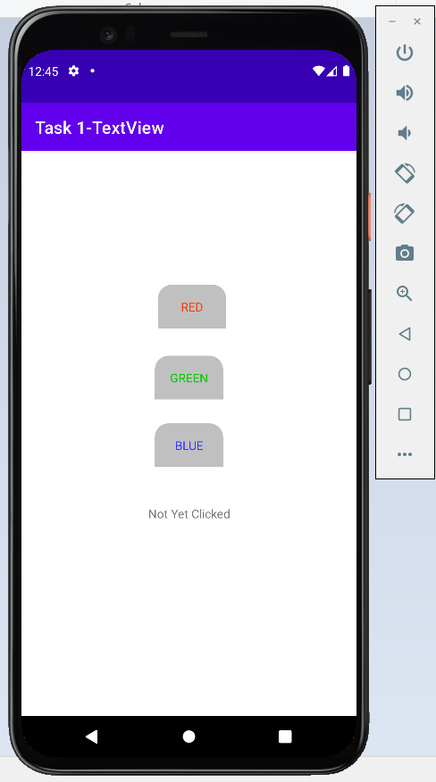
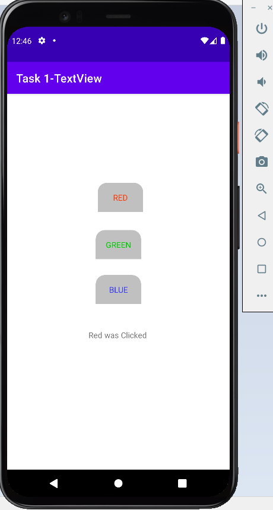
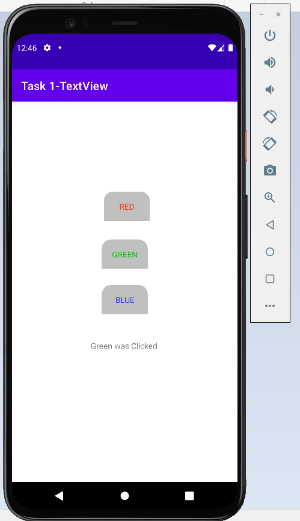
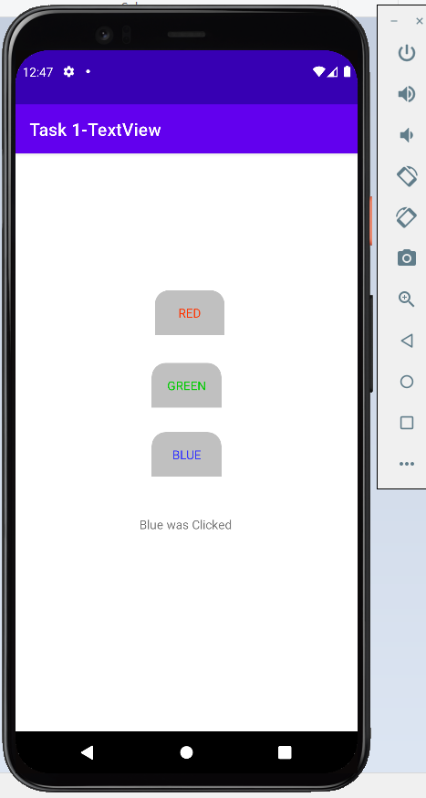

# Android-Studio---Task-1
An application that has 4 TextViews
3 text views will work as a buttons with text of different color. When the specific color button is clicked, the 4th TextView text must be updated to notify that the specific button has been clicked.

<h1>Output</h1>

 

 

